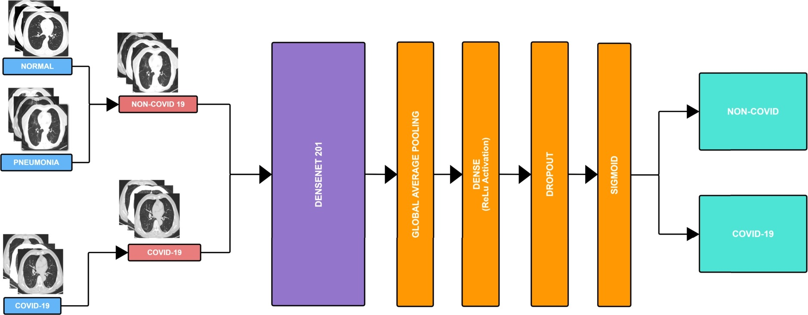

# COVID-19_Detection
Official Repository for <b>A Novel Approach for detecting Normal, COVID-19 and Pneumonia patient using only binary classifications from chest CT-Scans.</b>

Link to paper - [Click here](https://www.sciencedirect.com/science/article/pii/S2772528622000310)


Link to dataset - [Click here](https://www.kaggle.com/datasets/hgunraj/covidxct)

### Workflow of Phase -1 : 
<p align="center"></p>

### Workflow of Phase -2 : 
<p align="center"></p>


If you find our work useful, can cite our paper using:

```
@article{HASIJA2022100069,
title = {A Novel Approach for detecting Normal, COVID-19 and Pneumonia patient using only binary classifications from chest CT-Scans},
journal = {Neuroscience Informatics},
pages = {100069},
year = {2022},
issn = {2772-5286},
doi = {https://doi.org/10.1016/j.neuri.2022.100069},
url = {https://www.sciencedirect.com/science/article/pii/S2772528622000310},
author = {Sanskar Hasija and Peddaputha Akash and Maganti {Bhargav Hemanth} and Ankit Kumar and Sanjeev Sharma},
keywords = {COVID-19, Chest CT Scan, CNN, Two Binary Classifications, Multi class Classification, Classification Metrics},
abstract = {The novel Coronavirus, Severe Acute Respiratory Syndrome Coronavirus 2 (SARS-CoV-2) spread all over the world, causing a dramatic shift in circumstances that resulted in a massive pandemic, affecting the world's well-being and stability. It is an RNA virus that can infect both humans as well as animals. Diagnosis of the virus as soon as possible could contain and avoid a serious COVID-19 outbreak. Current pharmaceutical techniques and diagnostic methods tests such as Reverse Transcription-Polymerase Chain Reaction (RT-PCR) and Serology tests are time-consuming, expensive, and require a well-equipped laboratory for analysis, making them restrictive and inaccessible to everyone. Deep Learning has grown in popularity in recent years, and it now plays a crucial role in Image Classification, which also involves Medical Imaging. Using chest CT scans, this study explores the problem statement automation of differentiating COVID-19 contaminated individuals from healthy individuals. Convolutional Neural Networks (CNNs) can be trained to detect patterns in computed tomography scans (CT scans). Hence, different CNN models were used in the current study to identify variations in chest CT scans, with accuracies ranging from 91% to 98%. The Multi class Classification method is used to build these architectures. This study also proposes a new approach for classifying CT images that uses two binary classifications combined to work together, achieving 98.38% accuracy. All of these architectures' performances were compared using different classification metrics.}
}
}
```


# Quick Links
Two different models were trained in two differnt phases for 70 and 14 epochs respectively.

### Notebooks for training: 

* [Notebook](https://github.com/sanskar-hasija/COVID-19_Detection/blob/main/Phase-1.ipynb) - Phase-1 Training 

* [Notebook](https://github.com/sanskar-hasija/COVID-19_Detection/blob/main/Phase-1.ipynb) - Phase-2 Training 

The trained model for evaluation and inference can be downloaded from [here](https://github.com/sanskar-hasija/COVID-19_Detection/tree/main/models).


Predictions from both phase-1 and phase-2 on the test set were combined and confusion matrix for each phase as well as for combined phases was constructed.
* [Notebook](https://github.com/sanskar-hasija/COVID-19_Detection/blob/main/Testing_Evaluation.ipynb) - Evaluation 


# Training Curves 
### Accuracy Curves : 
<p align="center"> </p>

### Loss Curves : 
<p align="center"> </p>

# Results:

### Positive Predictive Value 
<div class="tg-wrap"><table class="tg">
  <tr>
    <th class="tg-7btt" colspan="3">Positive Predictive Value (%)</th>
  </tr>
  <tr>
    <td class="tg-7btt">Normal</td>
    <td class="tg-7btt">Pneumonia</td>
    <td class="tg-7btt">COVID-19</td>
  </tr>
  <tr>
    <td class="tg-c3ow">98.99</td>
    <td class="tg-c3ow">99.56</td>
    <td class="tg-c3ow">95.62</td>
  </tr>
</table></div>

### Sensitivity
<div class="tg-wrap"><table class="tg">
  <tr>
    <th class="tg-7btt" colspan="3">Sensitivity (%)</th>
  </tr>
  <tr>
    <td class="tg-7btt">Normal</td>
    <td class="tg-7btt">Pneumonia</td>
    <td class="tg-7btt">COVID-19</td>
  </tr>
  <tr>
    <td class="tg-c3ow">99.40</td>
    <td class="tg-c3ow">97.50</td>
    <td class="tg-c3ow">97.42</td>
  </tr>
</table></div>

### Specificity
<div class="tg-wrap"><table class="tg">
  <tr>
    <th class="tg-7btt" colspan="3">Specificity (%)</th>
  </tr>
  <tr>
    <td class="tg-7btt">Normal</td>
    <td class="tg-7btt">Pneumonia</td>
    <td class="tg-7btt">COVID-19</td>
  </tr>
  <tr>
    <td class="tg-c3ow">99.10</td>
    <td class="tg-c3ow">99.81</td>
    <td class="tg-c3ow">98.68</td>
  </tr>
</table></div>

### F1-Score 
<div class="tg-wrap"><table class="tg">
  <tr>
    <th class="tg-7btt" colspan="3">F1-Score (%)</th>
  </tr>
  <tr>
    <td class="tg-7btt">Normal</td>
    <td class="tg-7btt">Pneumonia</td>
    <td class="tg-7btt">COVID-19</td>
  </tr>
  <tr>
    <td class="tg-c3ow">99.19</td>
    <td class="tg-c3ow">98.52</td>
    <td class="tg-c3ow">96.57</td>
  </tr>
</table></div>

### Confusion Matrix
<p align="left"></p>
